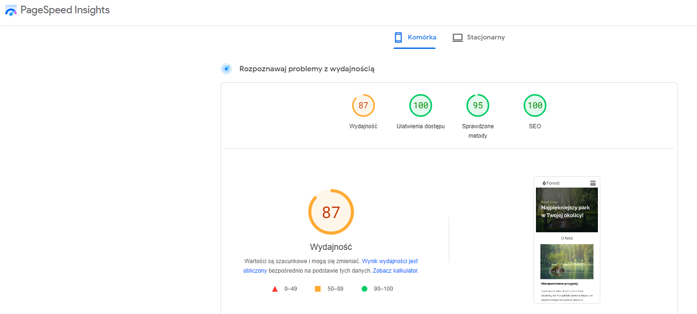

## Project Overview ℹ️

Forest Group Website. This project is a part of course from <a href="https://mmcschool.pl/kursy/kurs-tworzenia-stron-www-cz-4.html">MMC School</a>. The mockup of Home Page was designed by MMC School. Subpages were designed by myself. The code is my own. In this project I used an open-source JavaScript <a href="https://gulpjs.com/">Gulp</a>.

This page was written in polish language. When you first enter the page, you are going to see the main page with sections: "about" and "offers". In "offers" section you can find the "Więcej ofert" button and go to the offer subpage.  
On contact subpage I used API from <a href="https://developers.google.com/maps">Google Maps Platform</a>. There you can also find a contact form with validation. Fill in the form correctly and received a popup information.

## Tech used 🧰
<p align="left">
<a href="https://developer.mozilla.org/en-US/docs/Web/HTML?retiredLocale=pl"></a>
<a href="https://developer.mozilla.org/en-US/docs/Web/CSS?retiredLocale=pl"></a>
<a href="https://sass-lang.com/"></a>
<a href="https://developer.mozilla.org/en-US/docs/Web/JavaScript"></a>
<a href="https://gulpjs.com/"></a>

- HTML
- CSS
- SASS & BEM
- Javascript
- Tools: Gulp

</p>

## Screenshots 📺

- offer section

<p align="center">
    
</p>

- offer subpage
   <p align="center">
       
   </p>

- contact subpage
   <p align="center">
       
   </p>

## Code Example/Issues 📧

If you have any issues, please let me know in the issues section or directly to 

## Performance 🚀

Checked with <a href="https://pagespeed.web.dev/?utm_source=psi&utm_medium=redirect">PageSpeed Insights</a>

- on desktop
  <p align="center">
  
  </p>
- on mobile
  <p align="center">
  
  </p>

<p align="center">It may be different on your device.</p>

## Installation 💾

To run this project, you must have the following dependencies installed:

- Node.js and NPM (https://nodejs.org)
- Git (https://git-scm.com)

```bash
git clone https://github.com/lilunia/Forest.git
npm install
npm run start
```

## Live 💥

<a href="https://lilunia.github.io/Forest/">https://lilunia.github.io/Forest/</a>
